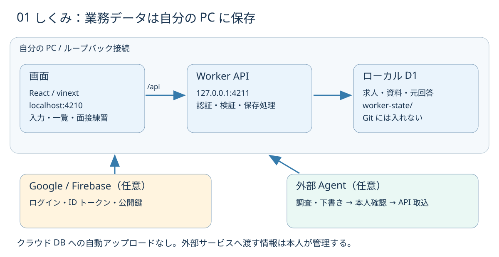

# Career Note — 就職準備を、ひとつの手帖に

**求人の比較から応募書類、面接練習まで。自分の PC で動く、日本での就職・転職活動ワークスペース。**


> 求人を見つけるたびに、メモ・履歴書・面接の回答が別々の場所に増えていく。
> Career Note は「どの企業に、どの資料で、次に何をするか」を一か所につなぎます。

[ローカル導入](docs/local-setup.md) · [図解ガイド](docs/illustrated-guide.md) · [開発工程と文書一覧](docs/README.md) · [既知の制約](docs/limitations.md) · [変更履歴](CHANGELOG.md)

## 何ができる？

| 困りごと | Career Note でできること |
| --- | --- |
| 求人の条件や出典を見失う | 企業・職種・出典 URL・確認日・不明点をまとめる |
| 応募状況と次の行動がばらばら | 状況、予定日、次の行動と履歴を記録する |
| 応募先ごとの資料が混ざる | 履歴書・職務経歴書・志望動機・企業研究を企業に紐づける |
| 面接で同じところにつまずく | 質問集、元の回答、外部 Agent の添削を履歴として残す |
| AI の会話だけでは情報が流れてしまう | 調査・資料作成を依頼し、確認済みの成果をローカルに保存する |

**現在は v0.1.0 のローカル向けプレビューです。** README と開発文書は日本語、アプリ画面・一部の Agent 手順は中国語です。Google ログインは任意。AI を Web 画面から直接呼び出す機能、自動応募、企業への連絡、音声認識はありません。

## まず動かす

必要なものは **Node.js 22.13 以上（22 LTS または 24 LTS）と npm**。Python、Docker、Cloudflare アカウント、AI API キーは通常のローカル起動に不要です。初回の依存取得にはインターネット接続が必要です。

```sh
git clone https://github.com/erzhiqianyi/career-note.git
cd career-note
npm ci
npm run dev
```

[http://localhost:4210](http://localhost:4210) を開きます。Ctrl+C でフロントエンドと API を停止します。

- 画面：`localhost:4210`
- Worker API：`127.0.0.1:4211`
- データ：`~/.local/share/career-note/worker-state/`（Git 管理外）

macOS / Linux / Windows の WSL2 を導入対象としています。OS 別手順、ポート変更、Google ログイン、バックアップは[ローカル導入手順](docs/local-setup.md)を参照してください。全 OS・全環境での動作を保証するものではなく、検証範囲は[テスト結果](docs/verification.md)に記録します。

## 仕組みをひと目で



画面は React / vinext、API は Cloudflare Workers、保存先は Wrangler が PC 上で動かすローカル D1 です。通常の起動で Cloudflare にデータをアップロードしません。Google ログインを使う場合は Firebase、外部 Agent に調査を頼む場合はその Agent のサービスと通信します。

Google ログインしたユーザーごとに、求人・履歴・資料・練習記録を独立したワークスペースに保存します。新規ユーザーは空の状態から始まり、他のユーザーや従来の本機モードの資料は閲覧できません。

## 最初の使い方

1. プロフィール画面で経歴・希望条件を入力する。
2. 求人を登録して出典と確認日を残す。
3. 応募先の次の行動を決める。
4. 必要なら外部 Agent に企業研究や資料作成を依頼する。Agent には MCP アドレスを登録し、ブラウザーで許可するだけでよい（[接続手順](docs/local-setup.md#ai-agent-の接続mcp--oauth)、ホスト型 Agent 向けの `npm run dev:tunnel` も同じ節）。
5. 面接練習で回答を保存し、振り返る。

実データを入れる前に試すには、別の空データディレクトリを指定し、[架空のサンプル](examples/README.md)を使ってください。

## Google ログインを使う

Firebase で Web アプリを登録し、Google プロバイダーと `localhost` を有効にします。

```sh
cp -n .dev.vars.example .dev.vars
```

`.dev.vars` に Firebase の Web 設定を記入し、再起動します。サービスアカウントの秘密鍵は不要です。[詳細手順](docs/local-setup.md#google-ログイン任意)

## 開発する

```sh
npm test
npm run typecheck
npm run check:docs
npm run build
```

`npm run doctor` で起動中の画面・API・プロキシを確認できます。`npm start` も開発構成の起動コマンドです。Google の実アカウントでのログインは各自の Firebase 設定後に検証してください。

[CONTRIBUTING](CONTRIBUTING.md) に変更手順、[SECURITY](SECURITY.md) に認証境界と脆弱性報告方法を記載しています。

## 日本の開発工程を学ぶ

このリポジトリは、動くアプリと合わせて **企画 → 予算 → 要件 → 設計 → 実装 → テスト → リリース → 運用・廃止** の文書を公開します。[文書マップ](docs/README.md)から各工程をたどれます。

文書は現行コードから整理した設計書と、新規プロジェクト向けの記入例・テンプレートです。架空の予算や承認を実績として扱いません。日本のすべての企業に共通する必須帳票ではなく、IPA の共通フレーム等を参考に、小規模 OSS 向けに取捨選択しています。

## ライセンスと画像

[MIT License](LICENSE)。依存ライブラリにはそれぞれのライセンスが適用されます。[第三者素材・画像の扱い](THIRD_PARTY_NOTICES.md)を参照してください。概念イラストは AI 生成のオリジナル素材、技術図は編集可能な SVG / Mermaid です。既存書籍の図版や商標を転載していません。
