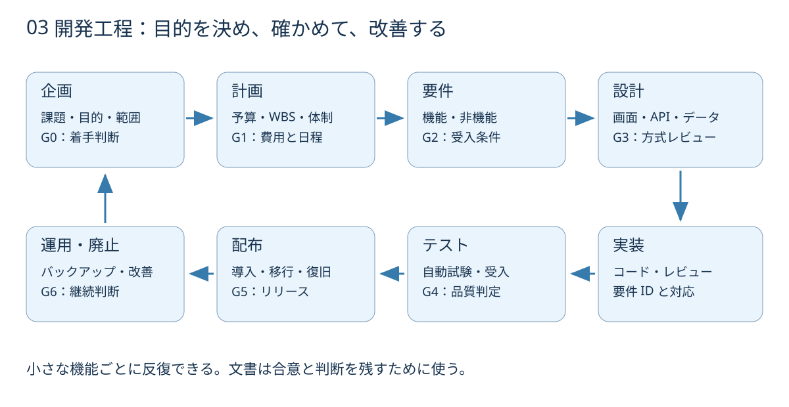

# 開発ドキュメント — 企画から運用まで

**読む順序：利用者は導入手順から、開発者は要求と設計から、企画担当者はプロジェクト計画から。**

## この文書セットの位置づけ

2026-09-12 に現行の v0.1.0 実装をもとに整理した文書です。設計の事後整理と、新規プロジェクトの計画例を区別します。ステータス「記入例」は予算確保・契約・承認の実績を意味しません。変更時は該当文書、テスト、変更履歴を同じ PR で更新します。

## 工程と成果物

| 工程 / ゲート | 成果物 | 作成 → レビュー / 判断 | 完了の判断 |
| --- | --- | --- | --- |
| 企画 / G0 | [企画書・プロジェクト憲章](lifecycle/01-charter.md) | 企画担当 → 利用責任者 | 解決したい問題、対象外、成功指標が合意済み |
| 計画 / G1 | [予算・見積り・WBS](lifecycle/02-plan-budget.md) | PM → スポンサー | 範囲、工数、費用、余裕、担当が合意済み |
| 要件 / G2 | [要件定義](lifecycle/03-requirements.md) | 利用者・BA → PM / 開発 | 要求 ID と受入条件が対応する |
| 基本設計 / G3 | [構成・データ設計](lifecycle/04-architecture.md)、[画面・操作設計](lifecycle/05-ux.md) | 開発・UX → 利用者 / セキュリティ | 正常系・異常系・データ境界を説明できる |
| 詳細設計 | [API・処理設計](lifecycle/06-api.md)、[ADR](adr/0001-local-worker.md) | 開発 → 開発レビュー | 入出力、保存、エラー、代替案が明確 |
| 実装 | [開発・構成管理](lifecycle/07-development.md)、[貢献手順](../CONTRIBUTING.md) | 開発 → レビュアー | レビュー可能な差分と検証結果がある |
| テスト / G4 | [テスト・受入計画](lifecycle/08-test-acceptance.md)、[検証記録](verification.md) | QA → 利用責任者 | 必須受入条件を満たし、残課題が明示される |
| リリース / G5 | [リリース・移行・切戻し](lifecycle/09-release.md) | リリース担当 → メンテナー | 配布物・手順・復旧方法が揃う |
| 運用 / G6 | [運用・保守・廃止](lifecycle/10-operations.md) | 運用担当 → 所有者 | バックアップと復旧訓練を記録する |
| 全工程 | [リスク・変更・コミュニケーション](lifecycle/11-governance.md)、[テンプレート](templates/README.md) | PM → 関係者 | 判断の理由と未決事項を追える |

1 人で開発する場合も、役割を分けてセルフレビューします。「作った人」と「使う目的を確認する人」の視点を分けるためであり、形式的な承認印を増やすためではありません。反復開発ではこの一巡を機能単位で短く回します。

## 操作・学習資料

- [ローカル導入・Google ログイン](local-setup.md)
- [図解：できること・データの流れ・人と Agent の役割](illustrated-guide.md)
- [制約とロードマップ](limitations.md)
- [サンプルデータ](../examples/README.md)
- [Agent ワークフロー（中国語）](agent-workflow.md) / [スキルアーカイブ（中国語）](skills.md)

## 参照した一次資料

- IPA [共通フレーム2013](https://www.ipa.go.jp/publish/secbooks20130304.html)：構想から開発、運用、保守、廃棄までの作業と役割を考える参照枠。本書式への準拠認証を示すものではありません。
- IPA [SLCP の解説](https://www.ipa.go.jp/digital/kaihatsu/slcp/index.html)：ライフサイクル全体と運用から上流へのフィードバックを確認。
- IPA [非機能要求グレード](https://www.ipa.go.jp/archive/digital/iot-en-ci/jyouryuu/hikinou/ent03-b.html)：非機能条件を具体化するための参考。
- IPA [ソフトウェア開発見積りガイドブック](https://www.ipa.go.jp/archive/publish/secbooks20060425.html)：見積りの前提・根拠・見直しを記録する参考。本文の単価はこの資料から引用した相場ではありません。

参照確認日：2026-09-12。企業固有の稟議、購買、契約、法務、情報セキュリティ、検収様式は組織に合わせて追加します。受託案件では RFP・提案書・見積書・契約・検収書が加わりますが、本 OSS の公開は受託契約ではありません。
