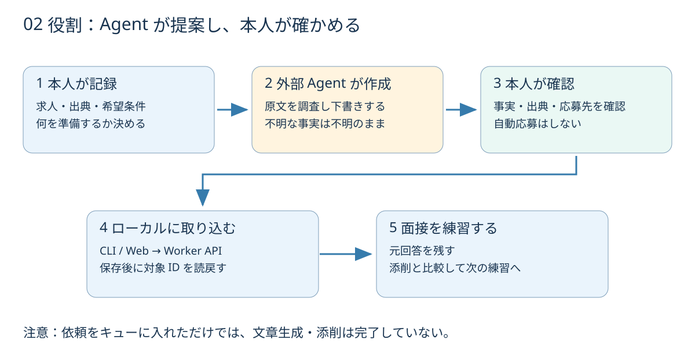

# 図解でわかる Career Note

## 1. 「情報を集める」から「準備につなげる」へ

**左：散らばる情報 → 中央：企業を軸に整理 → 右：自分の言葉で説明する。**

求人を保存するだけでは面接準備は終わらない。会社の求める経験、自分の事実、その事実を使った回答を結ぶ必要がある。本アプリはそのつながりを記録する道具。

架空の例：サンプル企業 A の Web エンジニア求人を登録する。必要なスキルと未確認条件を書き、自分の経歴のどの部分が対応するか整理する。面接の質問に回答し、添削と比較する。実際に応募したかどうかは本人だけが更新する。

## 2. 画面・処理・保存を分ける

- **画面は窓口**：入力と確認をしやすくする。
- **API は受付と確認**：認証と入力を確認し、保存する。
- **D1 は保管場所**：サービスを止めても次回読めるようにする。

「Workers」は実行方式の名前。ここでは `wrangler dev` により PC 上で動く。GitHub にソースを公開しても、利用者の D1 データが公開されるわけではない。

## 3. 人と Agent の分担

アプリは依頼を保存し、外部 Agent が内容を作る。Agent の出力を本人が確認し、API から取り込む。アプリ内に自動生成モデルを組み込んでいないため、好きな対応クライアントを使える一方、依頼しただけで自動的に結果が戻るわけではない。

原回答は本人の記録。添削は提案。不明な経歴を補って採用向けの事実に変えない。資料の版と出典を区別することが、この道具の中心にある。

## 4. Google ログインは「入口の鍵」

Google ログインはアカウントを確認する。Worker が署名と許可リストを確認してから資料を返す。複数の鍵を許可しても、部屋は 1 つ。利用者別に独立した部屋を用意する SaaS とは違う。

Google を使わない本機モードでは、PC にアクセスできる人からデータを隔離する機能はない。用途に応じて OS のユーザー管理とディスク保護を使う。

## 5. 新しいシステムを作るときの道筋

企画書は「何を作るか」より先に「なぜ作るか」を合わせる。要件定義は受入条件を決める。設計は処理とデータの責任を分ける。テストはその約束を確かめる。配布後も、バックアップ・更新・廃止を考える。

本リポジトリの [工程別文書](README.md) はこの流れに対応する。仮の予算、未実施のテスト、実装済みの機能を別々に読むことで、設計書の体裁だけでは分からない実態を把握できる。
