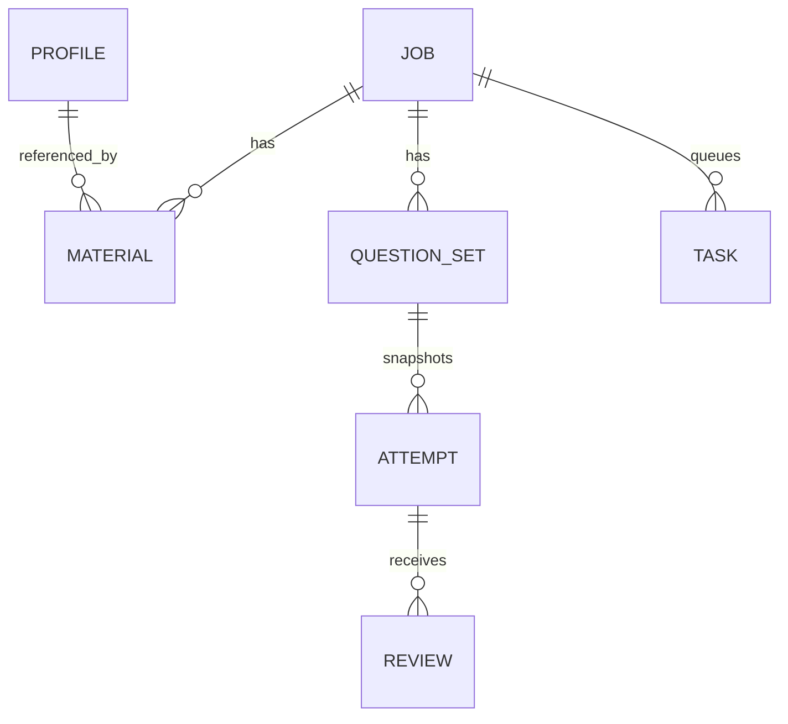

# 04 基本設計・データ設計

状態：現行コードの説明。最新の正は `worker/index.ts` と `vite.config.ts`。

## 責務と信頼境界

| 構成要素 | 責務 | 保管するもの |
| --- | --- | --- |
| React / vinext | 表示、入力、保存要求、Agent 指示文のコピー | 画面状態。Firebase SDK のセッション管理あり |
| Vite プロキシ | `/api/career/*` をローカル Worker に転送 | 業務データは永続化しない |
| Worker | 入力検証、認証、権限、D1 操作 | D1 へ書き込む |
| ローカル D1 | records / meta / mcp_tokens | 求人、資料、回答、設定、トークンのハッシュ |
| Firebase Auth（任意） | Google サインイン、ID トークン発行 | Firebase プロジェクトの認証ユーザー |
| 外部 Agent（任意） | 調査、文章案、添削 | 利用者が渡したデータは当該サービスの扱いに従う |

Google へ送るのはログインに必要な情報。職務経歴を Firebase Firestore に保存する設計ではない。外部 Agent に渡す範囲は利用者が管理する。「ローカル保存」は、外部サービスとの通信が全くないという意味ではない。

## 起動から保存まで

1. `npm run dev` が Node.js のアーカイブ処理を実行する。
2. 起動スクリプトが `.env`、ポート、データ保存先を解決し、2 つの子プロセスを起動する。
3. ブラウザーが `/api/career/auth/config` を取得する。
4. 認証が必要なら Firebase SDK で Google ログインする。
5. API に Bearer ID トークンを送り、署名・クレーム・許可アカウントを検証する。
6. Worker が必要なテーブルを作成し、対象データを取得・保存する。

## 論理データモデル

これは論理関係。現在の SQLite スキーマに外部キー制約として宣言されているわけではない。関連チェックは処理単位で行われるため、すべての整合性が DB によって保証されると考えない。

| 物理テーブル | 主キー・主要列 | 内容 |
| --- | --- | --- |
| records | `(kind, id)`、body JSON | jobs / materials / reports / tasks / questionSets / attempts / reviews / platforms:UID |
| meta | id、body JSON | id=`profile` のプロフィール |
| mcp_tokens | id、token_hash unique、owner_uid、scopes、expires_at、revoked | Agent 用 Bearer トークン管理 |

JSON 内に revision、createdAt、sourceNotes 等を保持する。プロフィールや求人の更新は revision を比較するが、すべての更新に原子的な楽観ロックがあるわけではない。複数同時編集は前提にしない。

## 保存先と移行

新規利用の既定値は `~/.local/share/career-note/worker-state/`。`CAREER_DATA_DIR` はその親ディレクトリを置き換える。実装は Wrangler が管理する内部ファイル名に依存しない。新規の空保存先を使う。旧データの互換読込みは提供しない。

現時点でバージョン付き DB マイグレーション機構はない。スキーマ変更時は移行・切戻し設計とバックアップ検証を先に追加する。`CREATE TABLE IF NOT EXISTS` は完全なマイグレーションではない。
