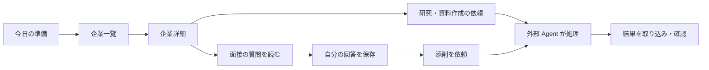

# 05 画面・操作設計

状態：現行画面の説明と受入観点。UI は現在中国語。下記の日本語名は説明用。

## 情報設計

| 画面 | 利用者が答えたいこと | 主な操作 |
| --- | --- | --- |
| 今日の準備（今日准备） | 今日、何から進めるか | 求人・未処理タスク・レポートを見る |
| 企業と応募（公司与投递） | この会社の準備はどこまで進んだか | 登録・絞り込み・詳細・状況更新 |
| 求人サービス（求职平台） | どこで求人を探すか | 検索、追加、編集、お気に入り |
| プロフィール（我的履历） | どの事実を資料に使うか | 要約と希望条件を保存 |
| 資料（准备资料） | この版はどの企業向けか | 企業別・種類別に読む |
| 面接練習（面试练习） | この質問に自分の言葉で答えられるか | 質問、回答保存、添削依頼、履歴 |
| Agent 連携（Agent 协作） | 何を依頼し、何が戻ったか | 指示コピー、import、export、スキル表示 |
| 管理（管理后台） | 連携トークンを管理したい | 管理者のみ発行・失効 |

## 主操作の遷移

**保存と依頼を分ける。** 回答の保存だけで AI 評価が生成されたように見せない。読み手が「自分の原回答」「Agent の参考改写」「確認済み事実」を混同しない文言にする。

## ログインの状態

| 状態 | 表示と挙動 |
| --- | --- |
| 設定読込中 | ログイン設定の読込表示。業務データは表示しない |
| strict / 未ログイン | Google ログイン画面 |
| strict / 設定不足 | 設定不足を表示し、ログインボタンを無効化 |
| Firebase 認証成功・許可外 | アクセス拒否とアカウント切替手段を表示 |
| 許可済み | ワークスペースを取得して表示 |
| ログアウト | 表示データ・編集中の関連状態を消去しログイン画面に戻す |
| off | 本機モードで表示。共有 PC の利用者まで区別するものではない |

## 入力・エラー・アクセシビリティ

必須項目は企業・職種等。保存中は重複操作を抑止する。競合時は更新済みメッセージと再読込を案内し、無断で上書きしない。通信失敗時は成功メッセージを表示しない。

受入ではキーボード移動、ラベル、フォーカス復帰、狭い画面、200% 拡大、長文、空データを確認する。これらは試験項目であり、現時点で WCAG 適合を宣言するものではない。画面全体の日本語化と既存アクセシビリティ指摘の解消はロードマップで管理する。

## 画面レビュー G3

典型的な 1 社の架空データで、一覧→詳細→資料→練習をたどる。利用者に「次に何をするか」「保存されたか」「誰が書いたか」を説明してもらう。観察結果を記録し、単に画面を見せたことを受入完了にしない。
