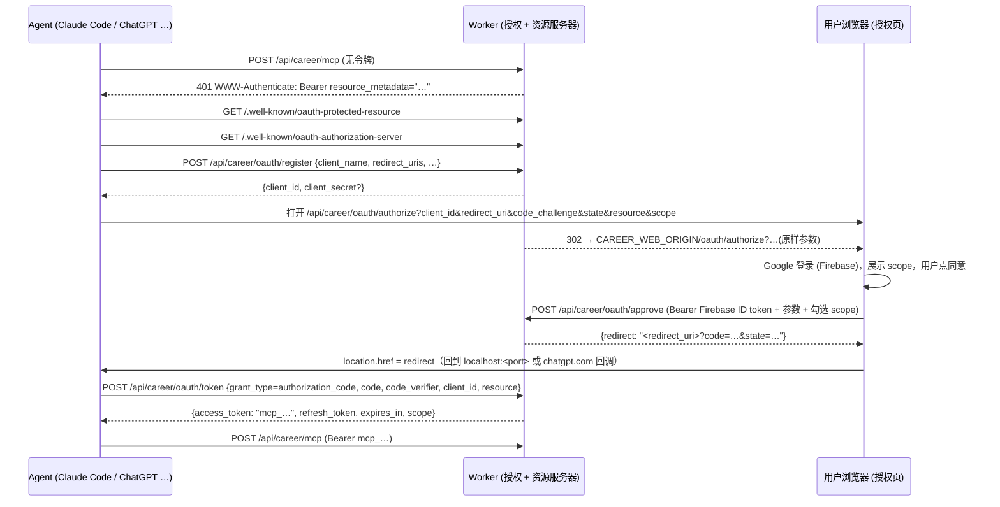

# Career Note MCP OAuth 接入设计（草案）

状态：已实现（2026-09-14，本机 + 隧道阶段）。已定：废除手动签发令牌，OAuth 为唯一接入方式；`off` 模式采用 §7.4 的 B 方案。实现：[@ninomae/mcp-app-server](https://github.com/erzhiqianyi/mcp-app-server)（2026-09-15 抽成独立开源包，2026-09-16 起改用 npm 发布版 `@ninomae/mcp-app-server@^0.1.0`，见 [迁移记录](mcp-app-server-migration.md)；Career Note 只保留 [worker/agent-tools.ts](../worker/agent-tools.ts) 的工具表与 Firebase 身份适配）、[components/oauth-consent.tsx](../components/oauth-consent.tsx)、[tests/oauth.test.mjs](../tests/oauth.test.mjs)。对应 [06 API](lifecycle/06-api.md)、[04 构成](lifecycle/04-architecture.md)、[Agent 工作流](agent-workflow.md)。采纳后应补一份 ADR-0002，并把端点表合并进 06。

## 1. 目标与范围

让任何支持 MCP 授权规范的 AI Agent（Claude Code、Codex CLI、Cursor、VS Code、Gemini CLI、Claude.ai 连接器、ChatGPT 连接器）通过标准 OAuth 2.1 流程接入 Career Note，用户在浏览器里登录并同意后，Agent 自动拿到访问令牌，不再需要手动复制粘贴 `mcp_` 令牌。

**范围内**

- Worker 作为 OAuth **授权服务器 + 资源服务器**（同一 origin）。
- 动态客户端注册（RFC 7591）、PKCE（RFC 7636）、授权码、刷新令牌、资源指示（RFC 8707）。
- 授权同意页面。
- **废除手动签发令牌**：`POST /mcp/tokens` 删除，OAuth 成为签发 `mcp_` 令牌的唯一途径；列表和撤销接口保留用于管理 OAuth 签发的令牌。

**范围外**

- 第三方 IdP 联合登录（用户身份仍然只来自 Firebase Google 登录）。
- 令牌内省 / 撤销标准端点（RFC 7662 / 7009）——撤销继续用现有网页 UI。
- 多租户 / 组织级别的客户端管理。

## 2. 部署形态

| 阶段 | Worker 地址 | 授权页地址 | 适用 Agent |
| --- | --- | --- | --- |
| 本机（`npm run dev`） | `http://127.0.0.1:4211` | `http://localhost:4210` | Claude Code、Codex CLI、Cursor、VS Code、Gemini CLI |
| 隧道（`npm run dev:tunnel`） | `.env` 有 `CAREER_TUNNEL`+`CAREER_PUBLIC_ORIGIN` 时用具名隧道的固定域名，否则 `https://<random>.trycloudflare.com` → 4211 | `http://localhost:4210`（仍在本机） | 上述 + Claude.ai / ChatGPT 连接器 |
| 公开网页 | `https://<公开域名>` | 同域 | 全部 |

关键观察：**只有 well-known、register、token、MCP 四个端点需要被 Agent 的服务器访问到**；authorize 页面是在用户自己的浏览器里打开的，所以隧道阶段只暴露 4211 即可，授权页仍走 localhost:4210。

Worker 需要知道自己的对外 origin 和授权页 origin，新增两个环境变量：

| 变量 | 含义 | 本机默认 | 隧道 | 公开 |
| --- | --- | --- | --- | --- |
| `CAREER_PUBLIC_ORIGIN` | 写进 metadata、`resource`、令牌 audience 的 Worker 对外地址 | 从请求 `Host` 推导 | 隧道域名（显式设置，避免 Host 转发不一致） | 公开域名 |
| `CAREER_WEB_ORIGIN` | authorize 跳转到的前端地址 | `http://localhost:4210`（`scripts/dev.mjs` 注入） | 同左 | 与 PUBLIC 相同或不设 |

公开部署时 `CAREER_AUTH_MODE` 必须为 `strict`；`off` 模式下 Worker 拒绝服务 OAuth 端点（返回 503，见 §8）。

## 3. 流程



刷新：`grant_type=refresh_token` → 校验 → 撤销旧 access/refresh，签发新的一对（轮换）。

## 4. 端点规格

所有 OAuth 端点响应 `cache-control: no-store`。错误格式遵循 RFC 6749 `{error, error_description}`，不复用现有 `{error: "…"}`（Agent 客户端按标准字段解析）。

### 4.1 `GET /.well-known/oauth-protected-resource` 和 `/.well-known/oauth-protected-resource/api/career/mcp`

两条路径返回相同内容（新旧客户端各查一种）：

```json
{
  "resource": "https://<origin>/api/career/mcp",
  "authorization_servers": ["https://<origin>"],
  "scopes_supported": ["career:read", "agent:write", "career:write"],
  "bearer_methods_supported": ["header"]
}
```

### 4.2 `GET /.well-known/oauth-authorization-server`

```json
{
  "issuer": "https://<origin>",
  "authorization_endpoint": "https://<origin>/api/career/oauth/authorize",
  "token_endpoint": "https://<origin>/api/career/oauth/token",
  "registration_endpoint": "https://<origin>/api/career/oauth/register",
  "response_types_supported": ["code"],
  "grant_types_supported": ["authorization_code", "refresh_token"],
  "code_challenge_methods_supported": ["S256"],
  "token_endpoint_auth_methods_supported": ["none", "client_secret_post", "client_secret_basic"],
  "scopes_supported": ["career:read", "agent:write", "career:write"]
}
```

注意：这两个 well-known 路径在 `/api/career` 前缀之外，[worker/index.ts](../worker/index.ts) 里 `pathname.startsWith('/api/career')` 的 404 守卫之前要先处理它们；`vite.config.ts` 的代理也要加 `/.well-known`，让 4210 也能当 MCP 地址用。

### 4.3 `POST /api/career/oauth/register`

无需认证。请求体按 RFC 7591：`client_name`、`redirect_uris[]`、`token_endpoint_auth_method`（默认 `none`）、`grant_types`、`scope`。

校验：

- `redirect_uris` 非空，每个 URI 满足 §8.1 规则。
- `token_endpoint_auth_method` ∈ `none | client_secret_post | client_secret_basic`；机密客户端生成 `client_secret`（随机 32 字节，只存 SHA-256）。
- 限速：每 IP 每小时 20 次（Worker 内存计数即可，本机无所谓，公开时防止表膨胀）。

响应 201：`client_id`（UUID）、`client_secret`（仅机密客户端、仅此一次）、`client_id_issued_at`、回显注册字段。

### 4.4 `GET /api/career/oauth/authorize`

参数：`response_type=code`、`client_id`、`redirect_uri`、`code_challenge`、`code_challenge_method=S256`、`state`、可选 `scope`、可选 `resource`。

Worker 只做**形式校验**，不落库：

- `client_id` 存在且 `redirect_uri` 与注册值**精确匹配**（localhost 类允许端口不同，见 §8.1）。
- `code_challenge_method` 必须是 `S256`。
- `resource` 若给出必须等于 `<PUBLIC_ORIGIN>/api/career/mcp`。

校验失败：若 `redirect_uri` 本身可信则按 RFC 重定向带 `error=invalid_request`，否则直接 400 页面。
校验通过：302 到 `<WEB_ORIGIN>/oauth/authorize?` + 原始查询串。

### 4.5 `POST /api/career/oauth/approve`（授权页另用 `GET /api/career/oauth/client?client_id=` 读取客户端名和回调去向）

授权页调用。认证：现有 `getAuthContext`，要求 `tokenType === 'firebase'`（`off` 模式见 §8.4）。

请求体：authorize 的全部参数 + `scopes[]`（用户实际勾选）+ `decision: "approve" | "deny"`。

处理：

1. 重复 4.4 的校验（防止直接构造请求绕过）。
2. `scopes` ⊆ 客户端请求的 scope（未请求则视为请求了 `scopes_supported` 全部）∩ 允许集合。
3. `deny` → 返回 `{redirect: "<redirect_uri>?error=access_denied&state=…"}`。
4. `approve` → 生成 code（随机 32 字节），写 `oauth_codes`（存 hash），10 分钟过期，返回 `{redirect: "<redirect_uri>?code=…&state=…"}`。

前端拿到 `redirect` 后 `window.location.href = redirect`。不由 Worker 直接 302 是因为这个请求带 Firebase Bearer，是 fetch 而不是导航。

### 4.6 `POST /api/career/oauth/token`

`application/x-www-form-urlencoded`（标准）和 JSON 都接受。

**authorization_code**：

1. 客户端认证：公开客户端只核 `client_id`；机密客户端核 `client_secret`（body 或 Basic）。
2. 查 `oauth_codes`：hash 匹配、未使用、未过期、`client_id` 匹配、`redirect_uri` 匹配。
3. PKCE：`base64url(sha256(code_verifier)) === code_challenge`。
4. `resource` 若给出必须与 code 记录一致。
5. 标记 code 已用（重复使用 → 撤销该 code 已签发的令牌，RFC 6819 建议）。
6. 调 `createMcpToken`（改为内部函数，不再有 HTTP 入口；参数加 `clientId`、`audience`）签发 access token；生成 refresh token 写 `oauth_refresh_tokens`。

响应：

```json
{
  "access_token": "mcp_…",
  "token_type": "Bearer",
  "expires_in": 2592000,
  "refresh_token": "mcr_…",
  "scope": "career:read agent:write"
}
```

**refresh_token**：核 hash、未撤销、未过期、`client_id` 匹配 → 撤销旧 access + refresh → 签发新一对。refresh 有效期 90 天（`CAREER_OAUTH_REFRESH_DAYS`），access 沿用 `MCP_TOKEN_TTL_DAYS`（30 天）。

### 4.7 现有 `POST /api/career/mcp` 的改动

- 无 `Authorization` 或令牌无效：401 附 `WWW-Authenticate: Bearer resource_metadata="<PUBLIC_ORIGIN>/.well-known/oauth-protected-resource", error="invalid_token"`。这是 Agent 触发 OAuth 流程的信号；现在返回的裸 401 JSON 不会触发。
- 令牌 `audience` 必须等于本 MCP URL。升级前手动签发的旧令牌 `audience` 为空，一律拒绝（等于升级即失效，用户重新授权一次即可；v0.1.0 预览阶段不做迁移）。
- scope 不足：403 附 `WWW-Authenticate: Bearer error="insufficient_scope"`。

## 5. 数据模型

新增三张表，同样在 `ensureSchema` 里 `CREATE TABLE IF NOT EXISTS`：

```sql
CREATE TABLE IF NOT EXISTS oauth_clients (
  client_id TEXT PRIMARY KEY,
  client_secret_hash TEXT,            -- 公开客户端为 NULL
  client_name TEXT NOT NULL,
  redirect_uris TEXT NOT NULL,        -- JSON 数组
  token_endpoint_auth_method TEXT NOT NULL,
  scope TEXT,                         -- 注册时声明，可空
  created_at TEXT NOT NULL,
  last_used_at TEXT
);

CREATE TABLE IF NOT EXISTS oauth_codes (
  code_hash TEXT PRIMARY KEY,
  client_id TEXT NOT NULL,
  owner_uid TEXT NOT NULL,
  redirect_uri TEXT NOT NULL,
  scopes TEXT NOT NULL,               -- JSON 数组
  code_challenge TEXT NOT NULL,
  resource TEXT,
  expires_at TEXT NOT NULL,
  used_at TEXT,
  issued_token_id TEXT                -- 用于重复使用时的连带撤销
);

CREATE TABLE IF NOT EXISTS oauth_refresh_tokens (
  token_hash TEXT PRIMARY KEY,
  client_id TEXT NOT NULL,
  owner_uid TEXT NOT NULL,
  access_token_id TEXT NOT NULL,      -- 关联 mcp_tokens.id
  scopes TEXT NOT NULL,
  expires_at TEXT NOT NULL,
  revoked INTEGER NOT NULL DEFAULT 0
);
```

`mcp_tokens` 加两列（`ALTER TABLE … ADD COLUMN`，需处理已存在的情况）：

| 列 | 含义 |
| --- | --- |
| `client_id TEXT` | 签发该令牌的 OAuth 客户端 |
| `audience TEXT` | `<PUBLIC_ORIGIN>/api/career/mcp` |

两列对新签发的令牌都必填；旧行为 NULL 时校验直接拒绝。`name` 列改存注册时的 `client_name`，供列表显示。

现有 `revokeMcpToken` 扩展为同时撤销关联的 refresh token。过期的 `oauth_codes` 和 refresh 在每次 `ensureSchema` 后顺手 `DELETE … WHERE expires_at < now` 即可，不需要定时任务。

## 6. 授权页

新路由 `app/oauth/authorize/page.tsx`（vinext 支持 App Router 路由）。这是一个独立于主界面的精简页面：

1. 读取查询参数；`client_id` 缺失直接显示错误。
2. 调 `GET /api/career/oauth/client?client_id=…`（新增、公开、只返回 `client_name` 和 `redirect_uris` 的 host）显示"**Claude Code** 请求访问你的 Career Note"和回调去向（`localhost` / `chatgpt.com`），让用户能识别钓鱼。
3. 未登录：复用现有 `signInWithGoogle`；登录后显示 scope 勾选：

| scope | 显示文案 | 默认 |
| --- | --- | --- |
| `career:read` | 读取你的履历、求人、资料和练习记录 | 勾选、不可取消（没有 read 的令牌没意义） |
| `agent:write` | 保存研究报告、资料版本、问题集和点评；排队任务 | 勾选 |
| `career:write` | 更新履历摘要（其他研究技能不会用到） | **不勾选** |

只显示客户端请求的 scope；未请求则显示全部。

4. "同意" / "拒绝" → `approve` → 跳转。跳转前显示"正在返回 Claude Code…"；对自定义 scheme（`cursor://`）浏览器会弹确认，页面上加一行"如果没有自动跳转，请返回应用"。

5. `CAREER_AUTH_MODE=off` 时（§8.4）跳过登录，显示"本机模式：将以本机工作区身份授权"。

主界面"访问设置"：删除"创建令牌"表单和 [agent-connection.tsx](../components/agent-connection.tsx) 里"创建自己的访问令牌"步骤，接入步骤改为"复制 MCP 地址 → 在助手里添加 → 浏览器里登录并同意"。令牌列表只剩查看和撤销，每行显示客户端名、scope、签发时间、最近使用。

## 7. 安全规则

### 7.1 redirect_uri

| 类型 | 规则 |
| --- | --- |
| `http://localhost[:port]/…`、`http://127.0.0.1[:port]/…`、`http://[::1]` | 允许；匹配注册值时**忽略端口**（Claude Code / VS Code 每次随机端口，RFC 8252 §7.3） |
| 自定义 scheme（`cursor://…`、`vscode://…`） | 允许；scheme 必须含 `.` 或 `-` 之外的合法字符且不是 `http/https/javascript/data/file` |
| `https://…` | 允许；精确匹配 |
| `http://` 非本机 | 拒绝 |

不维护各家回调地址白名单——安全性来自 PKCE + 精确匹配 + code 一次性，白名单只会随各家改地址而过期。

### 7.2 授权码与令牌

- code：32 字节随机，只存 SHA-256，10 分钟过期，一次性；二次使用撤销已签发令牌。
- PKCE 只接受 S256；`plain` 拒绝。
- access token 复用 `mcp_` 格式和现有校验；refresh token 前缀 `mcr_`，同样只存 hash。
- refresh 轮换：旧的立即失效；检测到已轮换的 refresh 被重放 → 撤销整条链。
- audience 绑定：OAuth 签发的令牌只对签发时的 MCP URL 有效，换域名（例如隧道地址变了）需要重新授权，这是预期行为。

### 7.3 CSRF / 混淆

- `state` 原样透传，不校验（那是客户端的责任），但必须回传。
- approve 接口要求 Firebase Bearer，本身就不受 CSRF 影响；authorize 页对 `redirect_uri` 的展示让用户能看出去向。
- authorize 页面不放在 `/api/career` 下，避免和 API 的 `Origin` 检查纠缠；网关 `serveMcp` 里的 Origin 检查保留。

### 7.4 `off` 模式

本机 `off` 模式没有用户身份，两种选择：

- **A. 不提供 OAuth**（现状延伸）：well-known 返回 404，MCP 端点 401 时不带 `resource_metadata`。本机用户必须配 Firebase。
- **B. 本机放行**：approve 不要求登录，令牌绑定 `uid='local'`；authorize 页显示"本机模式"提示。

推荐 **B**——它让"`npm run dev` 然后 `claude mcp add`"零配置可用，这是本机 CLI 用户的主要场景；并且 `off` 模式本来就等于本机任何进程都能读写 API，OAuth 没有降低安全性。公开部署下 `off` 模式的 OAuth 端点一律返回 503；此外任何带 `cf-ray` 头（经隧道或 Cloudflare 边缘进入）的请求在 `off` 模式下整体返回 403，避免本机模式的无鉴权 API 被隧道暴露。

### 7.5 隧道阶段的注意点

- trycloudflare 域名每次都变：`CAREER_PUBLIC_ORIGIN` 变了，已签发令牌的 audience 失配，Agent 需重新 Authenticate。测试时用具名隧道（`cloudflared tunnel create`）可固定域名。
- 隧道期间 Worker 是公网可达的，`CAREER_AUTH_MODE` 必须 `strict`，`CAREER_ALLOWED_EMAILS` 限制到自己。

## 8. 各客户端兼容性检查表

| 客户端 | 注册类型 | 回调 | 需要公网 | 已知差异 |
| --- | --- | --- | --- | --- |
| Claude Code | 公开 | `http://localhost:<port>/callback` | 否 | 用 `/mcp` → Authenticate 触发；读 path-suffixed well-known |
| Codex CLI | 公开 | localhost | 否 | `codex mcp login <name>` 触发 |
| Cursor | 公开 | `cursor://…` | 否 | 自定义 scheme |
| VS Code | 公开 | `http://127.0.0.1:<port>/` 或 `vscode://` | 否 | — |
| Gemini CLI | 公开 | localhost | 否 | — |
| Claude.ai / Desktop 连接器 | 公开或手填 client_id | `https://claude.ai/api/mcp/auth_callback` 等 | **是** | 也可在 UI 手填 client_id/secret，此时需支持机密客户端 |
| ChatGPT 连接器 | 机密（可能） | `https://chatgpt.com/connector_platform_oauth_redirect` | **是** | 依赖 refresh token；scope 由 ChatGPT 侧配置 |

各家回调 URL 以实现当日文档为准，设计上不写死。

## 9. 测试计划

1. **单元 / miniflare**（沿用 [tests/tenant.test.mjs](../tests/tenant.test.mjs) 的 `dispatchFetch` 方式）：
   - well-known 两条路径内容一致且 origin 正确。
   - register：合法 / 非法 redirect_uri、机密客户端拿到 secret。
   - 完整流程：register → authorize（302 到 WEB_ORIGIN）→ approve（Firebase 模拟）→ token → MCP `tools/list` 成功。
   - PKCE 错误、code 二次使用、redirect_uri 不匹配、resource 不匹配、refresh 轮换重放。
   - 跨用户：用户 A 授权的令牌读不到用户 B 的数据（现有隔离测试扩展）。
   - `off` 模式 B 方案：approve 无需登录；PUBLIC_ORIGIN 为 https 时 503。
2. **本机手工**：Claude Code `claude mcp add --transport http career-note http://127.0.0.1:4211/api/career/mcp` → `/mcp` → Authenticate；Codex CLI 同样。记录到 [verification.md](verification.md)。
3. **隧道手工**：`cloudflared tunnel --url http://127.0.0.1:4211`，设置 `CAREER_PUBLIC_ORIGIN`，在 claude.ai 或 ChatGPT 添加连接器走一遍，并验证 30 天后（把 TTL 临时改成 1 分钟）refresh 生效。

## 10. 文档与配置更新

- [06 API](lifecycle/06-api.md)：端点表加 OAuth 一节；401/403 响应头说明。
- [04 构成](lifecycle/04-architecture.md)：授权服务器角色、公开部署模式。
- [agent-workflow.md](agent-workflow.md)、[skills.md](skills.md)、各 `.agents/skills/*/SKILL.md`：接入说明改为"添加 MCP 地址 → 浏览器授权"，删除所有关于复制令牌的文字。
- [scripts/career-data.mjs](../scripts/career-data.mjs)：`CAREER_API_TOKEN` 在 `strict` 模式下失去来源（没有手动令牌可填），该 CLI 降级为仅 `off` 模式可用，文档注明；或者后续给 CLI 加一个 device-code / localhost 回调登录，不在本设计范围内。
- [tests/tenant.test.mjs](../tests/tenant.test.mjs)：现在通过 `POST mcp/tokens` 取令牌，改为调用一个测试辅助函数走 register → approve → token 拿令牌。
- [local-setup.md](local-setup.md)：`CAREER_PUBLIC_ORIGIN` / `CAREER_WEB_ORIGIN` / 隧道章节。
- [limitations.md](limitations.md)：公开部署与 README"数据不上传 Cloudflare"承诺的关系。
- `.dev.vars.example`：新变量。
- `scripts/dev.mjs`：注入 `CAREER_WEB_ORIGIN`。
- `scripts/doctor.mjs`：检查 well-known 可达。

## 11. 工作量与阶段

| 阶段 | 内容 | 估计 |
| --- | --- | --- |
| P1 后端 | 三张表、well-known、register、authorize、approve、token、MCP 401 头、audience 校验；删除 `POST /mcp/tokens`；miniflare 测试改走 OAuth | 300–400 行 Worker + 250 行测试 |
| P2 授权页 | `app/oauth/authorize/page.tsx`、client 信息接口；删除创建令牌表单，改接入步骤文案 | 150–200 行（净减少前端代码） |
| P3 本机验证 | Claude Code / Codex CLI 手工走通，文档更新 | — |
| P4 隧道验证 | 具名隧道、Claude.ai / ChatGPT 连接器、refresh 验证 | — |
| P5 公开网页 | 部署方式确定后，同域配置、限速、监控 | 视部署方案 |

P1 完成后即可只用 curl 跑完整流程，不依赖前端。

## 12. 未决事项

1. **公开网页的部署形态**：前端和 Worker 是否同一个 Worker（vinext + cloudflare 插件的单 Worker）还是分离？决定 `CAREER_WEB_ORIGIN` 是否需要以及 CORS 是否要处理。
2. **`off` 模式采用 A 还是 B**（§7.4）。本文推荐 B。
3. **register 是否需要管理员开关**：公开部署后是否允许任意匿名注册，还是要求管理员在 UI 里先允许某个 `client_name`。本文默认允许 + 限速；如需收紧，加 `CAREER_OAUTH_OPEN_REGISTRATION=false` 并在 UI 加"待批准的客户端"列表。
4. **access token 有效期**：沿用 30 天还是缩短到 1 天并依赖 refresh。缩短更安全，但要先确认目标客户端都可靠地实现了 refresh（Claude Code 和 ChatGPT 都实现了；Cursor 待验证）。
5. **是否把 `career:write` 从 `scopes_supported` 里去掉**。手动令牌已废除，去掉就意味着任何 Agent 都不能改履历，[agent-workflow.md](agent-workflow.md) 里"用户要求更新摘要"的场景只能在网页里手动完成。本文默认保留但默认不勾选。
6. **`GET /mcp/tokens` 和 `revoke` 的路径**是否顺势改名为 `/oauth/tokens`，还是保持不动减少前端改动。本文建议保持不动。
